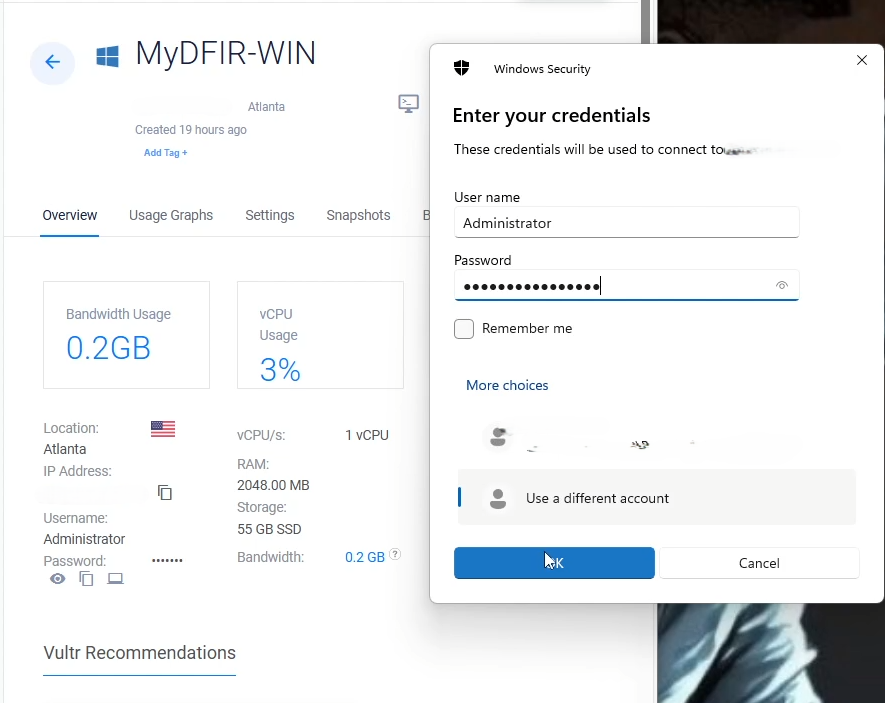
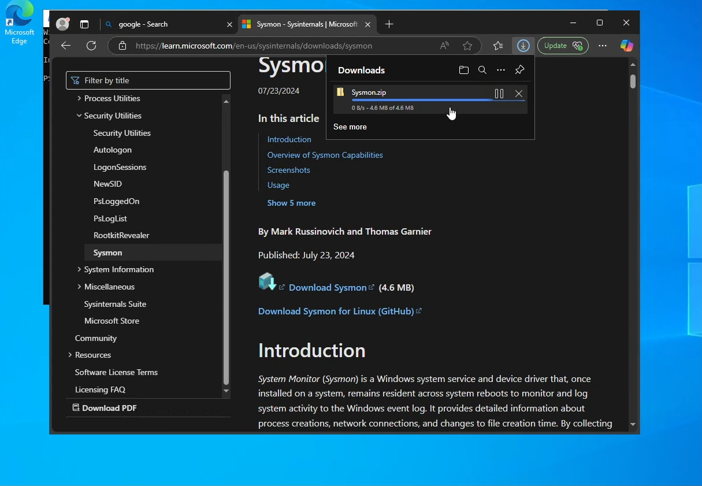
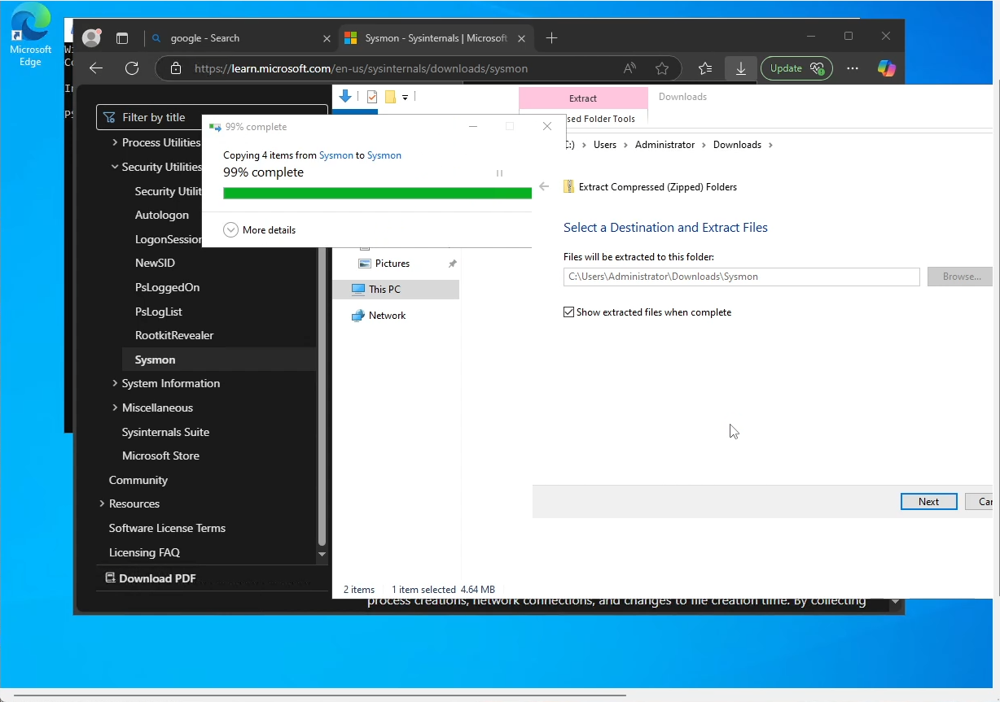
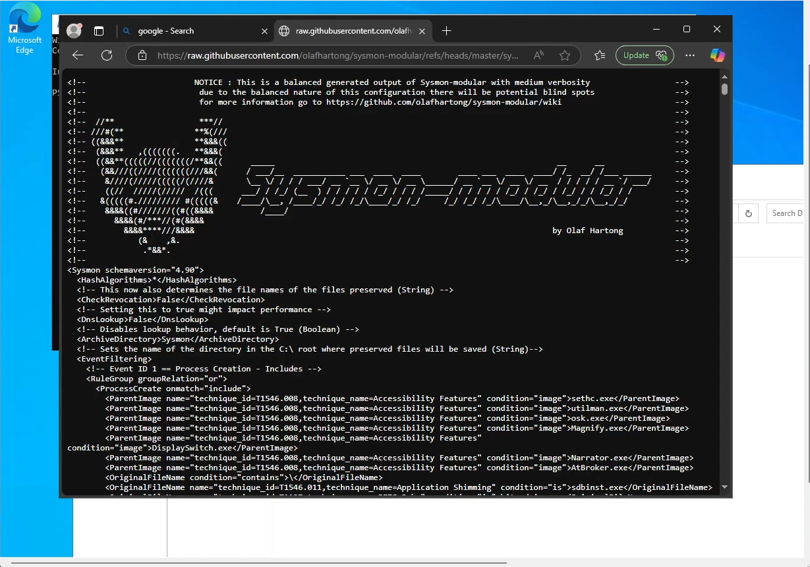
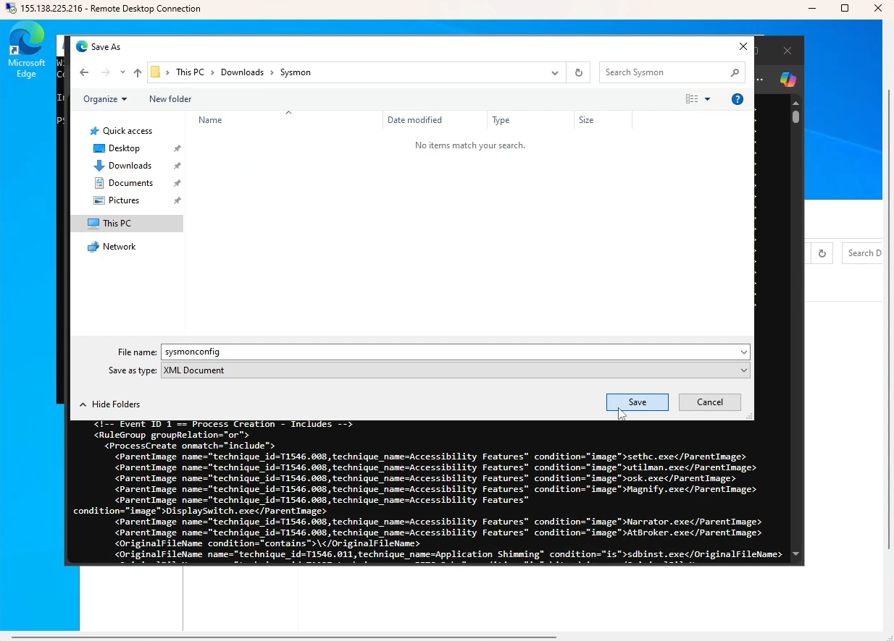

# 🔎 Sysmon on Windows Server 2022 — Olaf Hartong Config (v15.15)

This project documents how I installed **Sysmon v15.15** on **Windows Server 2022** using **Olaf Hartong’s sysmon-modular** configuration, then validated that events are being generated in **Event Viewer**.

> 🔐 Public repo note: blur/redact real hostnames, usernames, and IPs in screenshots. Use placeholders like `203.0.113.25` (public) and `10.0.0.x` (private).

---

## 📌 Project Overview
- **Platform:** Windows Server 2022 (Vultr)
- **Tooling:** Microsoft **Sysmon v15.15** + **Olaf Hartong’s `sysmonconfig.xml`**
- **Goal:** Install Sysmon with Olaf’s config and confirm telemetry (Event IDs 1/3/11) in **Sysmon/Operational**

---

## 🧱 Lab Architecture (simple)

| Component                   | Purpose                                  |
|----------------------------|-------------------------------------------|
| Windows Server 2022 (VM)   | Sysmon installed; writes to Event Log     |
| Sysmon service + driver    | Captures process, network, file telemetry |

📸 *Diagram placeholder*  


---

## ✅ Prerequisites
- RDP admin access to the Windows Server
- Internet egress to download Sysmon + Olaf’s config
- **PowerShell** launched **as Administrator**

---

## 🛠️ Steps (What I Actually Did)

### **Step 1 — RDP into the Windows Server**
Connected via RDP with an admin account.

📸 *Screenshot:*  


---

### **Step 2 — Download Sysmon v15.15**
I downloaded **Sysmon v15.15** (Sysinternals) to **Downloads** and **Extracted All** into a `Sysmon` folder.

📸 *Screenshots:*  
  


---

### **Step 3 — Get Olaf’s config (Raw → Save As)**
On Olaf Hartong’s GitHub page, I opened **`sysmonconfig.xml`**, clicked **Raw**, and **Saved As** into the same **Sysmon** folder as `sysmonconfig.xml`.

📸 *Screenshots:*  
  


---

### **Step 4 — Open PowerShell (Admin) & change directory**
- Opened **PowerShell (Run as Administrator)**
- In **File Explorer**, clicked the **address bar** in the Sysmon folder, copied the full path
- In PowerShell, ran `cd "<that path>"`, then `dir` to confirm I was in the folder with **Sysmon64.exe** and **sysmonconfig.xml**

```bash
# Example — paste the path copied from File Explorer
cd "C:\Users\<you>\Downloads\Sysmon"
dir
```
📸 Screenshots:


### **Step 5 — Install Sysmon with Olaf’s config**
Ran the installer pointing to the config file:

powershell
Copy code
```bash
.\Sysmon64.exe -i sysmonconfig.xml
```
Expected result: Sysmon accepts EULA, installs the service/driver, and applies Olaf’s rules.

📸 Screenshot:

✅ Optional hardening (future): use -accepteula -h sha256 to auto-accept the EULA and enable SHA256 hashing:

powershell
Copy code
```bash
.\Sysmon64.exe -i sysmonconfig.xml
```


### **Step 6 — Verify service and recent events**
Checked the service and sampled recent events:

powershell
Copy code
# Service status
Get-Service -Name sysmon* | Format-List Name,Status,StartType

# Quick sample of Sysmon events
Get-WinEvent -LogName "Microsoft-Windows-Sysmon/Operational" -MaxEvents 5 |
  Select-Object Id, TimeCreated, ProviderName |
  Format-Table -Auto
📸 Screenshots:


### **Step 7 — Validate in Event Viewer (filtered)
